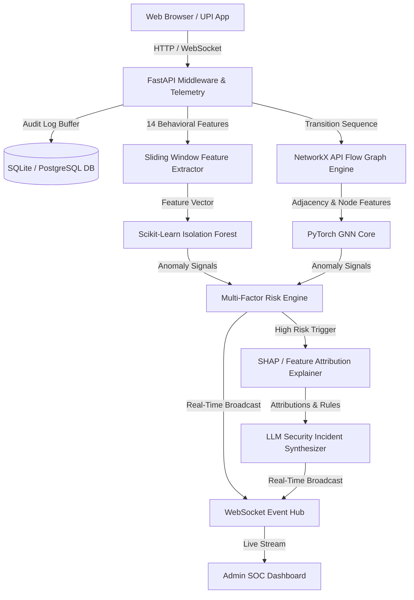

# Full Architecture Specification

## 1. System Overview
The **Real-World Indian E-Commerce + API Security Using AI/ML** platform is an enterprise-grade cyber-defense system natively integrated with a realistic Indian e-commerce marketplace. The system operates two interconnected environments:
1. **Customer Storefront**: Realistic Indian catalog across 4 categories (Fashion, Electronics, Home & Lifestyle, Beauty & Personal Care) with Indian Rupee (`₹`, `INR`) currency, dynamic UPI QR Code Scan & Pay checkout, and safe ₹0 Demo mode.
2. **Admin Security Operations Center (SOC)**: High-contrast White base with Deep Blue text and Electric/Neon Blue accents (`#0066ff`), providing zero-latency live WebSocket incident streams, interactive NetworkX API flow graphs, XAI/SHAP feature attributions, and LLM threat synthesis.

## 2. Component Layers
- **Frontend Layer**: React 18 SPA built with Vite, Vanilla CSS design tokens (`admin.css`, `index.css`), Lucide icons, Recharts visualizations, and WebSocket stream handlers.
- **API & Middleware Layer**: FastAPI ASGI pipeline with request telemetry logging, rate limiting (Token bucket / IP), JWT authentication, and RBAC authorization.
- **Behavioral Feature Layer**: 14-dimensional sliding window metrics tracking request velocity, error distributions, sensitive endpoint access, and sequence deviations.
- **Detection & Risk Engine**: Hybrid multi-factor evaluator combining statistical heuristics, Isolation Forest continuous scoring, and PyTorch GNN structural anomaly detection.
- **Explainability & Synthesis Layer**: Kernel/Tree SHAP explainer with deterministic fallback and LLM threat explanation generator.
